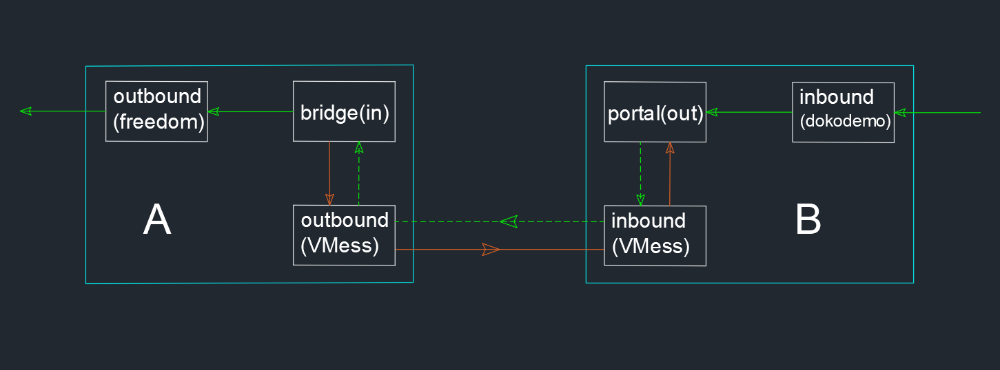

# Reverse Proxy I

The reverse proxy is a relatively high-mentioned feature request. Since the v2.x release, many people have asked developers if they can join this feature until v4.0 is finally available. The reverse proxy is mainly used for intranet penetration. It uses VPS to access intranet servers that do not have public IP. The specific example is that there is a NAS in the house. Because when your home broadband does not have a public IP, you can't directly access your NAS outside. But you can access the home NAS with a reverse proxy. If you don't have relative requirements, there is no need to read the following section.

When we talking about the reverse proxy, it must be indicated that FRP is widely used today. But in this tutorial, we will not discuss which one is better. However, the configuration of V2Ray is more difficult to understand. You will need to have a better understanding of V2Ray to configure the reverse proxy.

## Mechanism

For your easier understanding, assuming there are three types of devices in this section, A, B and C. Type of devices A does not have a public IP to access the internet, and it is running as a NAS or personal cloud. Type of devices B is a server which has a public IP address, like your VPS. Type of devices C is the device you want to use it access the NAS or personal cloud on device A. (Assuming you have a private cloud disk on device A, like NextCloud, and it listens to 80 port). Each of these three types of devices can be one or more. Let us first discuss one device for one type of case. To be able to establish a reverse proxy connection, both A and B must run V2Ray, and C may not run V2Ray. After setting up the configuration file and running V2Ray, the order of traffic delay in which the connections are established in the reverse proxy is:


1. A will initiate a request to B to establish a connection;
1. The user C initiates a request to B to access the private cloud disk on A;
1. B accepts the request of C, and forwards the traffic to A (that is, B reversely connects A);

The effect of the above process is equivalent to initiate a request from C to A, for accessing A's private network disk. A initiates a request to B, A needs an outbound, and B needs an inbound. (Because A's outbound is inbound to B, there are three protocols with inbound and outbound: VMess, Shadowsocks, and Socks. In this section we take VMess as an example). C initiates a request to B, B also needs an inbound, C does not run V2Ray (B's inbound to accept traffic that is not from V2Ray, can only be dokodemo-door). Because A is the final server of accessing (private network disk), A also needs an outbound, namely freedom. In other words, A requires two outbounds (VMess and freedom), and B requires two inbounds (VMess and dokodemo-door). Then in order for A to actively connect to B, A needs to configure a reverse proxy. Similarly, in order to allow B to connect back to A, B also needs to configure a reverse proxy. Finally, we need to configure the route.



## Configuration Example

The specific configuration is given below, please understand the description in the previous principle section.

### Configuration of Node A

```json
{  
  "reverse":{ 
    // This is the reverse proxy setting for A and must have the object of the following bridge
    "bridges":[  
      {  
        "tag":"bridge", // The reverse proxy tag of A, used in routing
        "domain":"private.cloud.com" // The domain name of the reverse proxy communication between A and B can be self-assigned. It may not be bought from the domain registry service provider, but it must be consistent with the reverse configured domain name in B below.
      }
    ]
  },
  "outbounds": [
    {  
      //The outbound of A connecting to B
      "tag":"tunnel", // The tag of outbound of A connecting to B, will be used in the following routing setting
      "protocol":"vmess",
      "settings":{  
        "vnext":[  
          {  
            "address":"serveraddr.com", // Address of B can be an IP or a domian
            "port":16823,
            "users":[  
              {  
                "id":"b831381d-6324-4d53-ad4f-8cda48b30811",
                "alterId":64
              }
            ]
          }
        ]
      }
    },
    // Another outbound connect of the private cloud disk
    {  
      "protocol":"freedom",
      "settings":{  
      },
      "tag":"out"
    }    
  ],
  "routing":{   
    "rules":[  
      {  
        // Configure the routing rules for A connecting to B
        "type":"field",
        "inboundTag":[  
          "bridge"
        ],
        "domain":[  
          "full:private.cloud.com"
        ],
        "outboundTag":"tunnel"
      },
      {  
        // The routing rules for reverse connection of private cloud disk
        "type":"field",
        "inboundTag":[  
          "bridge"
        ],
        "outboundTag":"out"
      }
    ]
  }
}
```

### Configuration of Node B

```json
{  
  "reverse":{  // This is the reverse proxy setting for B and must have the following portals object
    "portals":[  
      {  
        "tag":"portal",
        "domain":"private.cloud.com" // must be the same as the domain name set by A above
      }
    ]
  },
  "inbounds": [
    {  
      // Accept C's inbound
      "tag":"external", // tag, used in routing
      "port":80,
      // Open port 80 for receiving external HTTP access 
      "protocol":"dokodemo-door",
        "settings":{  
          "address":"127.0.0.1",
          "port":80, // Suppose the port that the NAS is listening on is 80.
          "network":"tcp"
        }
    },
    // Another inbound that accepts a request initiated by A
    {  
      "tag": "tunnel",// tag, used in routing
      "port":16823,
      "protocol":"vmess",
      "settings":{  
        "clients":[  
          {  
            "id":"b831381d-6324-4d53-ad4f-8cda48b30811",
            "alterId":64
          }
        ]
      }
    }
  ],
  "routing":{  
    "rules":[  
      {  // Routing rules, sent to A after receiving a C request
        "type":"field",
        "inboundTag":[  
          "external"
        ],
        "outboundTag":"portal"
      },
      {  // Routing rules that let B recognize that this is a proactively initiated reverse proxy connection
        "type":"field",
        "inboundTag":[  
          "tunnel"
        ],
        "domain":[  
          "full:private.cloud.com"
        ],
        "outboundTag":"portal"
      }
    ]
  }
}
```

## Access

After configuring the V2Ray configuration of A and B, run V2Ray of A and B successively, and also set up the private network disk of A to run. Then C accesses a different network than A (for example, to the neighbour's home network), and uses the browser to access the IP or domain name of B. At this time, the intranet can access the private cloud disk.


#### Updates

- 2018-10-31 Initial release
- 2019-01-13 V4.0+ Adaptation

