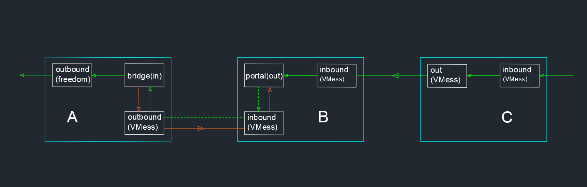

# Reverse Proxy II

In the previous section, we talked about reverse proxy. We use a reverse proxy to access intranet services (e.g. private network drives) that do not have public IP. But this reverse proxy has a limitation, that is, only a limited port mapping can be assigned. For example, in the previous section, we mapped the 80 ports of the private network disk. If I have a lot of devices in my home, I run a lot of software (such as private network disk, NAS, personal blog, code warehouse, etc.), the reverse of the previous section. Agents can also be used, but there is a distribution port mapping, which is not very elegant, and the configuration is annoying to write. This section introduces another way to configure the reverse proxy, solves the problem just mentioned, and has a stronger universality, which is more practical for the majority of users.

The example above may not be easy to understand; we can easily understand with a few examples of actual usage scenarios. The reverse proxy described in this section can be implemented:
- For overseas Chinese such as international students, sometimes they want to watch Chinese videos or listen to Chinese music. Because of copyright reasons, they can't directly watch on Chinese mainland websites. It is too expensive to buy a Chinese mainland VPS. If you build a V2Ray in your home in mainland China and buy an overseas VPS, you can use the reverse proxy to watch videos that the mainland can watch.
- For university students, you can use the reverse proxy to access campus network resources outside the university, download papers, etc.
- For programmers, you can view the company's code repository at home.
- For home users, you can watch home monitoring from the outside.

## Mechanism

The principle is similar to the reverse proxy in the previous section. The difference is that B's dokodemo-door is changed to VMess, and then C needs to install V2Ray to connect B's VMess. The final result is that C connects to B through V2Ray, and B reverses proxy to A, which is equivalent to C using V2Ray to access the Internet through A proxy.



(** Errata: The inbound of C in the figure should be Socks**)

## Configuration Example

The specific configuration is given below, please understand the description together with the previous principle section.

### Configuration of Node A

The configuration of A is the same from the previous section.

```json
{  
  "reverse":{ 
    // This is the reverse proxy setting for A, which must have the object of the following bridge
    "bridges":[  
      {  
        "tag":"bridge", // The reverse proxy tag of A, used in routing
        "domain":"private.cloud.com" // The domain name of the reverse proxy communication between A and B can be self-assigned. It may not be bought from the domain registry service provider, but it must be consistent with the reverse configured domain name in B below.
      }
    ]
  },
  "outbounds":[
    {  
      // The outbound of A connecting to B  
      "tag":"tunnel", // The tag of outbound of A connecting to B, will be used in the following routing setting
      "protocol":"vmess",
      "settings":{  
        "vnext":[  
          {  
            "address":"serveraddr.com", // Address of B can be an IP or a domian
            "port":16823,
            "users":[  
              {  
                "id":"b831381d-6324-4d53-ad4f-8cda48b30811",
                "alterId":64
              }
            ]
          }
        ]
      }
    },
    // Another outbound connect of the private cloud disk    
    {  
      "protocol":"freedom",
      "settings":{  
      },
      "tag":"out"
    }
  ],
  "routing":{  
    "rules":[  
      {  
      // Configure the routing rules for A connecting to B
        "type":"field",
        "inboundTag":[  
          "bridge"
        ],
        "domain":[  
          "full:private.cloud.com"
        ],
        "outboundTag":"tunnel"
      },
      {  
      // The routing rules for reverse connection of private cloud disk
        "type":"field",
        "inboundTag":[  
          "bridge"
        ],
        "outboundTag":"out"
      }
    ]    
  }
}
```

### Configuration of Node B

The configuration of B has only changed in the inbound section.

```json
{ 
"reverse":{ // This is the reverse proxy setting for B and must have the following portals object
"portals":[ 
{ 
"tag":"portal",
"domain":"private.cloud.com" // must be the same as the domain name set by A above
}
]
},
"inbounds": [
{ 
// Accept C's inbound
"tag":"external", // tag, used in routing
"port":80,
// Open port 80 for receiving external HTTP access 
"settings":{ 
"clients":[ 
{ 
"id":"a26efdb8-ef34-4278-a4e6-2af32cc010aa",
"alterId":64
}
]
}
},
// Another inbound that accepts a request initiated by A
{ 
"tag": "interconn",// Tag will used in routing
"port":16823,
"protocol":"vmess",
"settings":{ 
"clients":[ 
{ 
"id":"b831381d-6324-4d53-ad4f-8cda48b30811",
"alterId":64
}
]
}
}
],
"routing":{ 
"rules":[ 
{ // Routing rules, sent to A after receiving a C request
"type":"field",
"inboundTag":[ 
"interconn"
],
"outboundTag":"portal"
},
{ // Routing rules that let B recognize that this is a proactively initiated reverse proxy connection
"type":"field",
"inboundTag":[ 
"tunnel"
],
"domain":[ 
"full:private.cloud.com"
],
"outboundTag":"portal"
}
]
}
}
```


`Tips`: In the configuration B, you can use the same VMess inbound to accept requests from A and C to simplify configuration.

### Configuration of Node C

Same as with normal client configuration, the connected server is B, which is omitted here.

## Access

A, B, and C are all running V2Ray, and any network accessed by C is equivalent to access through A (C routing is not specially configured).


#### Updates

- 2018-11-01 Initial Version
- 2018-01-13 V4.0+ Adaptation
- 2019-07-15 Correction of `tag` term in the configuration of server B
