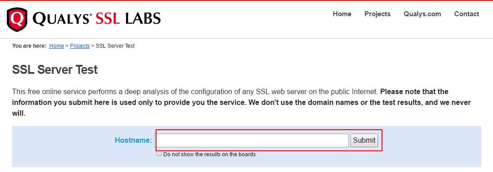
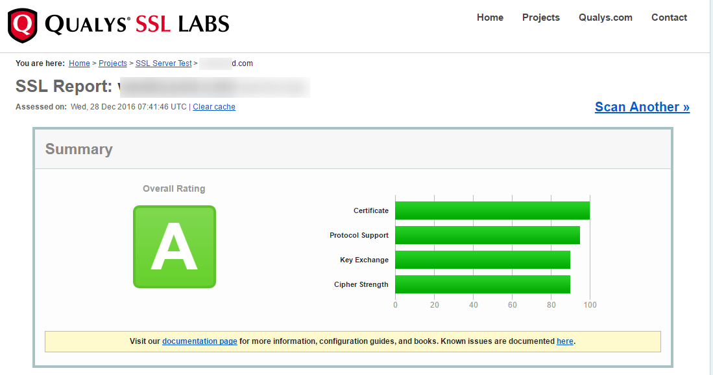
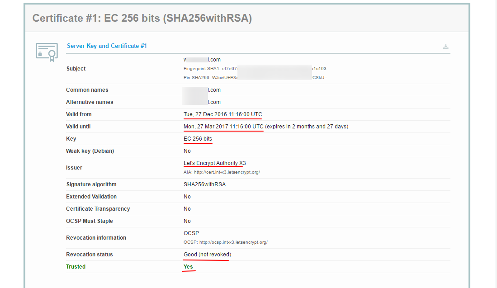

# TLS

從 v1.19 起引入了 TLS，TLS 中文譯名是傳輸層安全，如果你沒聽說過，請 Google 瞭解一下。以下給出些我認爲介紹較好的文章鏈接：

 [SSL/TLS協議運行機制的概述](http://www.ruanyifeng.com/blog/2014/02/ssl_tls.html)

 [傳輸層安全協議](https://zh.wikipedia.org/wiki/%E5%82%B3%E8%BC%B8%E5%B1%A4%E5%AE%89%E5%85%A8%E5%8D%94%E8%AD%B0)


## 註冊一個域名

如果已經註冊有域名了可以跳過。
TLS 需要一個域名，域名有免費的和有付費的，如果你不捨得爲一個域名每年花點錢，用個免費域名也可以，但總體來說付費的會優於免費的。爲了方便，在本文中我就忽略如何註冊購買域名了。關於如何獲取域名，具體搜索相關文章教程。

**註冊好域名之後務必記得添加一個 A 記錄指向你的 VPS!**

**以下假設註冊的域名爲 mydomain.me，請將之替換成自己的域名。**

## 證書生成

TLS 是證書認證機制，所以使用 TLS 需要證書，證書也有免費付費的，同樣的這裏使用免費證書，證書認證機構爲 [Let's Encrypt](https://letsencrypt.org/)。
證書的生成有許多方法，這裏使用的是比較簡單的方法：使用 [acme.sh](https://github.com/Neilpang/acme.sh) 腳本生成，本部分說明部分內容參考於[acme.sh README](https://github.com/Neilpang/acme.sh/blob/master/README.md)。

證書有兩種，一種是 ECC 證書（內置公鑰是 ECDSA 公鑰），一種是 RSA 證書（內置 RSA 公鑰）。簡單來說，同等長度 ECC 比 RSA 更安全,也就是說在具有同樣安全性的情況下，ECC 的密鑰長度比 RSA 短得多（加密解密會更快）。但問題是 ECC 的兼容性會差一些，Android 4.x 以下和 Windows XP 不支持。只要您的設備不是非常老的老古董，建議使用 ECC 證書。

以下將給出這兩類證書的生成方法，請大家根據自身的情況自行選擇其中一種證書類型。

證書生成只需在服務器上操作。

### 安裝 acme.sh

執行以下命令，acme.sh 會安裝到 ~/.acme.sh 目錄下。
```
$ curl  https://get.acme.sh | sh
% Total    % Received % Xferd  Average Speed   Time    Time     Time  Current
                               Dload  Upload   Total   Spent    Left  Speed
100   671  100   671    0     0    680      0 --:--:-- --:--:-- --:--:--   679
% Total    % Received % Xferd  Average Speed   Time    Time     Time  Current
                               Dload  Upload   Total   Spent    Left  Speed
100  112k  100  112k    0     0   690k      0 --:--:-- --:--:-- --:--:--  693k
[Fri 30 Dec 01:03:32 GMT 2016] Installing from online archive.
[Fri 30 Dec 01:03:32 GMT 2016] Downloading https://github.com/Neilpang/acme.sh/archive/master.tar.gz
[Fri 30 Dec 01:03:33 GMT 2016] Extracting master.tar.gz
[Fri 30 Dec 01:03:33 GMT 2016] Installing to /home/user/.acme.sh
[Fri 30 Dec 01:03:33 GMT 2016] Installed to /home/user/.acme.sh/acme.sh
[Fri 30 Dec 01:03:33 GMT 2016] Installing alias to '/home/user/.profile'
[Fri 30 Dec 01:03:33 GMT 2016] OK, Close and reopen your terminal to start using acme.sh
[Fri 30 Dec 01:03:33 GMT 2016] Installing cron job
no crontab for user
no crontab for user
[Fri 30 Dec 01:03:33 GMT 2016] Good, bash is found, so change the shebang to use bash as preferred.
[Fri 30 Dec 01:03:33 GMT 2016] OK
[Fri 30 Dec 01:03:33 GMT 2016] Install success!

```
安裝成功後執行 `source ~/.bashrc` 以確保腳本所設置的命令別名生效。

如果安裝報錯，那麼可能是因爲系統缺少 [acme.sh 所需要的依賴項](https://github.com/Neilpang/acme.sh/wiki/Install-preparations)，acme.sh 的依賴項主要是 socat，我們通過以下命令來安裝這些依賴項，然後重新安裝一遍 acme.sh:

```
$ sudo apt-get install openssl cron socat curl
```


### 使用 acme.sh 生成證書

#### 證書生成

執行以下命令生成證書：

以下的命令會臨時監聽 80 端口，請確保執行該命令前 80 端口沒有使用
```
$ sudo ~/.acme.sh/acme.sh --issue -d mydomain.me --standalone -k ec-256
[Fri Dec 30 08:59:12 HKT 2016] Standalone mode.
[Fri Dec 30 08:59:12 HKT 2016] Single domain='mydomain.me'
[Fri Dec 30 08:59:12 HKT 2016] Getting domain auth token for each domain
[Fri Dec 30 08:59:12 HKT 2016] Getting webroot for domain='mydomain.me'
[Fri Dec 30 08:59:12 HKT 2016] _w='no'
[Fri Dec 30 08:59:12 HKT 2016] Getting new-authz for domain='mydomain.me'
[Fri Dec 30 08:59:14 HKT 2016] The new-authz request is ok.
[Fri Dec 30 08:59:14 HKT 2016] mydomain.me is already verified, skip.
[Fri Dec 30 08:59:14 HKT 2016] mydomain.me is already verified, skip http-01.
[Fri Dec 30 08:59:14 HKT 2016] mydomain.me is already verified, skip http-01.
[Fri Dec 30 08:59:14 HKT 2016] Verify finished, start to sign.
[Fri Dec 30 08:59:16 HKT 2016] Cert success.
-----BEGIN CERTIFICATE-----
MIIEMTCCAxmgAwIBAgISA1+gJF5zwUDjNX/6Xzz5fo3lMA0GCSqGSIb3DQEBCwUA
MEoxCzAJBgNVBAYTAlVTMRYwFAYDVQQKEw1MZXQncyBFbmNyeXB0MSMwIQYDVQQD
ExpMZXQncyBFbmNyeXB0IEF1dGhvcml0eSBYMzAeFw0xNjEyMjkyMzU5MDBaFw0x
NzAzMjkyMzU5MDBaMBcxFTATBgNVBAMTDHdlYWtzYW5kLmNvbTBZMBMGByqGSM49
****************************************************************
4p40tm0aMB837XQ9jeAXvXulhVH/7/wWZ8/vkUUvuHSCYHagENiq/3DYj4a85Iw9
+6u1r7atYHJ2VwqSamiyTGDQuhc5wdXIQxY/YQQqkAmn5tLsTZnnOavc4plANT40
zweiG8vcIvMVnnkM0TSz8G1yzv1nOkruN3ozQkLMu6YS7lk/ENBN7DBtYVSmJeU2
VAXE+zgRaP7JFOqK6DrOwhyE2LSgae83Wq/XgXxjfIo1Zmn2UmlE0sbdNKBasnf9
gPUI45eltrjcv8FCSTOUcT7PWCa3
-----END CERTIFICATE-----
[Fri Dec 30 08:59:16 HKT 2016] Your cert is in  /root/.acme.sh/mydomain.me_ecc/mydomain.me.cer
[Fri Dec 30 08:59:16 HKT 2016] Your cert key is in  /root/.acme.sh/mydomain.me_ecc/mydomain.me.key
[Fri Dec 30 08:59:16 HKT 2016] The intermediate CA cert is in  /root/.acme.sh/mydomain.me_ecc/ca.cer
[Fri Dec 30 08:59:16 HKT 2016] And the full chain certs is there:  /root/.acme.sh/mydomain.me_ecc/fullchain.cer
```
`-k` 表示密鑰長度，後面的值可以是 `ec-256` 、`ec-384`、`2048`、`3072`、`4096`、`8192`，帶有 `ec` 表示生成的是 ECC 證書，沒有則是 RSA 證書。在安全性上 256 位的 ECC 證書等同於 3072 位的 RSA 證書。

#### 證書更新

由於 Let's Encrypt 的證書有效期只有 3 個月，因此需要 90 天至少要更新一次證書，acme.sh 腳本會每 60 天自動更新證書。也可以手動更新。

手動更新 ECC 證書，執行：
```
$ sudo ~/.acme.sh/acme.sh --renew -d mydomain.com --force --ecc
```

如果是 RSA 證書則執行：
```
$ sudo ~/.acme.sh/acme.sh --renew -d mydomain.com --force
```

**由於本例中將證書生成到 `/etc/v2ray/` 文件夾，更新證書之後還得把新證書生成到 /etc/v2ray。**

### 安裝證書和密鑰

#### ECC 證書

將證書和密鑰安裝到 /etc/v2ray 中：
```
$ sudo ~/.acme.sh/acme.sh --installcert -d mydomain.me --fullchainpath /etc/v2ray/v2ray.crt --keypath /etc/v2ray/v2ray.key --ecc
```

#### RSA 證書

```
$ sudo ~/.acme.sh/acme.sh --installcert -d mydomain.me --fullchainpath /etc/v2ray/v2ray.crt --keypath /etc/v2ray/v2ray.key
```

**注意：無論什麼情況，密鑰(即上面的v2ray.key)都不能泄漏，如果你不幸泄漏了密鑰，可以使用 acme.sh 將原證書吊銷，再生成新的證書，吊銷方法請自行參考 [acme.sh 的手冊](https://github.com/Neilpang/acme.sh/wiki/Options-and-Params)**

## 配置 V2Ray

### 服務器

```json
{
  "inbounds": [
    {
      "port": 443, // 建議使用 443 端口
      "protocol": "vmess",    
      "settings": {
        "clients": [
          {
            "id": "23ad6b10-8d1a-40f7-8ad0-e3e35cd38297",  
            "alterId": 64
          }
        ]
      },
      "streamSettings": {
        "network": "tcp",
        "security": "tls", // security 要設置爲 tls 纔會啓用 TLS
        "tlsSettings": {
          "certificates": [
            {
              "certificateFile": "/etc/v2ray/v2ray.crt", // 證書文件
              "keyFile": "/etc/v2ray/v2ray.key" // 密鑰文件
            }
          ]
        }
      }
    }
  ],
  "outbounds": [
    {
      "protocol": "freedom",
      "settings": {}
    }
  ]
}
```

### 客戶端

```json
{
  "inbounds": [
    {
      "port": 1080,
      "protocol": "socks",
      "sniffing": {
        "enabled": true,
        "destOverride": ["http", "tls"]
      },
      "settings": {
        "auth": "noauth"
      }
    }
  ],
  "outbounds": [
    {
      "protocol": "vmess",
      "settings": {
        "vnext": [
          {
            "address": "mydomain.me", // tls 需要域名，所以這裏應該填自己的域名
            "port": 443,
            "users": [
              {
                "id": "23ad6b10-8d1a-40f7-8ad0-e3e35cd38297",
                "alterId": 64
              }
            ]
          }
        ]
      },
      "streamSettings": {
        "network": "tcp",
        "security": "tls" // 客戶端的 security 也要設置爲 tls
      }
    }
  ]
}
```

## 驗證

一般來說，按照以上步驟操作完成，V2Ray 客戶端能夠正常聯網說明 TLS 已經成功啓用。但要是有個可靠的方法來驗證是否正常開啓 TLS 無疑更令人放心。
驗證的方法有很多，我僅介紹一種小白化一點的，便是 [Qualys SSL Labs's SSL Server Test](https://www.ssllabs.com/ssltest/index.html)。

**注意：使用 Qualys SSL Labs's SSL Server Test 要求使用 443 端口，意味着你服務器配置的 inbound.port 應當是 443**

打開 [Qualys SSL Labs's SSL Server Test](https://www.ssllabs.com/ssltest/index.html)，在
Hostname 中輸入你的域名，點提交，過一會結果就出來了。



這是對於你的 TLS/SSL 的一個總體評分，我這裏評分爲 A，看來還不錯。有這樣的界面算是成功了。


這是關於證書的信息。從圖中可以看出，我的這個證書有效期是從 2016 年 12 月 27 號到 2017 年的 3 月 27 號，密鑰是 256 位的 ECC，證書籤發機構是 Let's Encrypt，重要的是最後一行，`Trusted` 爲 `Yes`，表明我這個證書可信。

## 溫馨提醒

**V2Ray 的 TLS 不是僞裝或混淆，這是完整、真正的 TLS。因此才需要域名和證書。後文提到的 WS(WebSocket) 也不是僞裝。**
