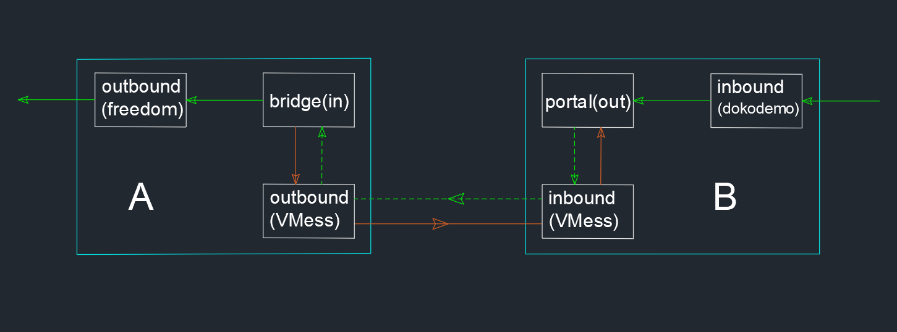

# 反向代理

反向代理是一個呼聲比較高的功能請求，從 v2.x 版本時就有不少人詢問開發者能否加入這個功能，直至 v4.0 終於推出了。反向代理的主要是用來作內網穿透，其實就是利用 VPS 訪問不具有公網 IP 的內網服務器。具體的例子是，家裏有一臺 NAS，因爲沒有公網 IP，正常情況下在外面（離開了家裏的網絡）沒法直接訪問這臺 NAS，但是通過反向代理就可以。如果看到這樣的舉例還不明白有什麼用，說明你沒有相關的需求，不必再折騰了。

提到反向代理，就不得不提一下如今廣爲推崇的 FRP，我不欲比較兩者在反向代理上孰優孰劣，我只是想提一句，V2Ray 的配置相較來說會難以理解一些，希望做好準備。

## 原理

爲了易於理解，本節約定有 3 種設備，名爲A, B, C。其中 A 爲不具備公網 IP 的內網服務器，運行了 NAS 或個人網盤等；B 爲具有公網 IP 的服務器，如平常我們購買的 VPS；C 爲想要訪問 NAS 或私有網盤的設備（本節假設你已經搭建好了私有網盤，監聽的端口爲 80）。這 3 種的每一種設備都可以是一臺或多臺，我們先以每種設備都是 1 臺來說明。爲了能夠建立反向代理連接，A 和 B 都要運行 V2Ray，C 可以不運行 V2Ray 。在設置好配置文件並運行 V2Ray 之後，反向代理中連接建立的次序爲：


1. A 會主動向 B 發起請求，建立起一個連接；
1. 用戶在 C 上向 B 發起請求，欲訪問 A 上的私有網盤；
1. B 接受 C 的請求，通過 A 向 B 建立的連接轉發給 A(即 B 反向連接了 A)；

以上過程效果就相當於 C 向 A 發起請求，達到了訪問 A 的私有網盤的目的。A 向 B 發起請求，A 需要一個 outbound ，B 需要一個 inbound（因爲 A 的 outbound 是連接到 B 的 inbound，具備 inbound 和 outbound 的協議有 3 種：VMess, Shadowsocks 和 Socks。本節以 VMess爲例）；C 向 B 發起請求，B 還需要一個 inbound，C 不運行V2（ B 的 inbound 要接受不是來自V2的流量，只能是任意門 dokodemo-door）；因爲是 A 來訪問最終的服務器(私有網盤)，所以 A 還需有一個 outbound，即 freedom。也就是說 A 需要兩個 outbound（VMess 和 freedom），B 需要兩個inbound(VMess 和 dokodemo-door)。然後爲了讓 A 能夠主動連接 B，A 需要配置反向代理(reverse)；同樣的，爲了能夠讓 B 反向連接 A，B 也需要配置反向代理(reverse)。最後還要配置好路由。



## 配置

以下給出具體配置，請結合原理部分的描述進行理解。

### A 的配置

```json
{  
  "reverse":{ 
    // 這是 A 的反向代理設置，必須有下面的 bridges 對象
    "bridges":[  
      {  
        "tag":"bridge", // 關於 A 的反向代理標籤，在路由中會用到
        "domain":"private.cloud.com" // A 和 B 反向代理通信的域名，可以自己取一個，可以不是自己購買的域名，但必須跟下面 B 中的 reverse 配置的域名一致
      }
    ]
  },
  "outbounds": [
    {  
      //A連接B的outbound  
      "tag":"tunnel", // A 連接 B 的 outbound 的標籤，在路由中會用到
      "protocol":"vmess",
      "settings":{  
        "vnext":[  
          {  
            "address":"serveraddr.com", // B 地址，IP 或 實際的域名
            "port":16823,
            "users":[  
              {  
                "id":"b831381d-6324-4d53-ad4f-8cda48b30811",
                "alterId":64
              }
            ]
          }
        ]
      }
    },
    // 另一個 outbound，最終連接私有網盤    
    {  
      "protocol":"freedom",
      "settings":{  
      },
      "tag":"out"
    }    
  ],
  "routing":{   
    "rules":[  
      {  
        // 配置 A 主動連接 B 的路由規則
        "type":"field",
        "inboundTag":[  
          "bridge"
        ],
        "domain":[  
          "full:private.cloud.com"
        ],
        "outboundTag":"tunnel"
      },
      {  
        // 反向連接訪問私有網盤的規則
        "type":"field",
        "inboundTag":[  
          "bridge"
        ],
        "outboundTag":"out"
      }
    ]
  }
}
```

### B 的配置

```json
{  
  "reverse":{  //這是 B 的反向代理設置，必須有下面的 portals 對象
    "portals":[  
      {  
        "tag":"portal",
        "domain":"private.cloud.com"        // 必須和上面 A 設定的域名一樣
      }
    ]
  },
  "inbounds": [
    {  
      // 接受 C 的inbound
      "tag":"external", // 標籤，路由中用到
      "port":80,
      // 開放 80 端口，用於接收外部的 HTTP 訪問 
      "protocol":"dokodemo-door",
        "settings":{  
          "address":"127.0.0.1",
          "port":80, //假設 NAS 監聽的端口爲 80
          "network":"tcp"
        }
    },
    // 另一個 inbound，接受 A 主動發起的請求  
    {  
      "tag": "tunnel",// 標籤，路由中用到
      "port":16823,
      "protocol":"vmess",
      "settings":{  
        "clients":[  
          {  
            "id":"b831381d-6324-4d53-ad4f-8cda48b30811",
            "alterId":64
          }
        ]
      }
    }
  ],
  "routing":{  
    "rules":[  
      {  //路由規則，接收 C 請求後發給 A
        "type":"field",
        "inboundTag":[  
          "external"
        ],
        "outboundTag":"portal"
      },
      {  //路由規則，讓 B 能夠識別這是 A 主動發起的反向代理連接
        "type":"field",
        "inboundTag":[  
          "tunnel"
        ],
        "domain":[  
          "full:private.cloud.com"
        ],
        "outboundTag":"portal"
      }
    ]
  }
}
```

## 訪問

配置好 A 和 B 的 V2Ray 配置後，先後運行 A 和 B 的 V2Ray，同時搭建在 A 私有網盤也要運行。然後 C 接入跟 A 不同的網絡（比如說到鄰居家蹭網），用瀏覽器訪問 B 的 IP 或域名，這時就能內網穿透訪問私有網盤了。


#### 更新歷史

- 2018-10-31 初版
- 2019-01-13 V4.0+ 配置格式

