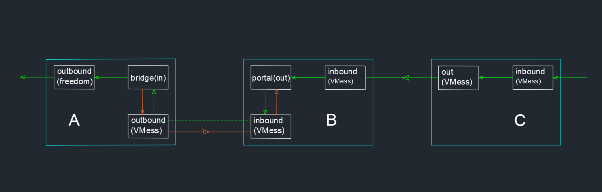

# 反向代理 2

上一節說了反向代理，我們利用反向代理訪問不具備公網 IP 的內網服務（私有網盤）。但是這種反向代理有一個侷限，那就是隻能分配有限的端口映射。比如說，上一節我們映射了私有網盤的 80 端口，如果我家裏有好多設備，運行了很多軟件（比如私有網盤、NAS、個人博客、代碼倉庫等），上一節說的反向代理也可以用，但是有一一分配端口映射，很不優雅，配置寫起來也煩。本節介紹另一種反向代理的配置方式，解決了剛剛所舉例子的問題，也具有更強的普適性，對於廣大網友來說更加實用。

上面所說的可能不太好理解，我用幾個實際的使用場景舉例就比較容易明白了。本節所說的反向代理可以實現：
- 對於留學生等海外華人，有時候想看中文的視頻或聽中文音樂等，因爲版權原因，沒法直接上大陸的網站觀看，買大陸的 VPS 又太貴。如果在大陸家裏搭建一個 V2Ray，再買一個海外的 VPS，利用反向代理就可以隨便看大陸可以看的視頻
- 對於大學生，可以利用反向代理在校外訪問校園網的資源，無限制下載論文等
- 對於程序員，可以在家裏查看公司的代碼倉庫
- 對於普通用戶，可以在外面看家裏的監控

## 原理

原理與上一節的反向代理大同小異，差別在於 B 的 dokodemo-door 改成 VMess，然後 C 需要安裝 V2Ray 連接 B 的 VMess。最終的效果就是 C 通過 V2Ray 連接 B，B 反向代理給 A，就相當於 C 使用 V2Ray 通過 A 代理上網。



（**勘誤：圖中 C 的 inbound 應爲 Socks**）

## 配置

以下給出具體配置，請結合原理部分的描述進行理解。

### A 的配置

A 的配置與上一節無變化。

```json
{  
  "reverse":{ 
    // 這是 A 的反向代理設置，必須有下面的 bridges 對象
    "bridges":[  
      {  
        "tag":"bridge", // 關於 A 的反向代理標籤，在路由中會用到
        "domain":"pc1.localhost" // 一個域名，用於標識反向代理的流量，不必真實存在，但必須跟下面 B 中的 reverse 配置的域名一致
      }
    ]
  },
  "outbounds":[
    {  
      //A連接B的outbound  
      "tag":"tunnel", // A 連接 B的 outbound 的標籤，在路由中會用到
      "protocol":"vmess",
      "settings":{  
        "vnext":[  
          {  
            "address":"serveraddr.com", // B 地址，IP 或 實際的域名
            "port":16823,
            "users":[  
              {  
                "id":"b831381d-6324-4d53-ad4f-8cda48b30811",
                "alterId":64
              }
            ]
          }
        ]
      }
    },
    // 另一個 outbound，最終連接私有網盤    
    {  
      "protocol":"freedom",
      "settings":{  
      },
      "tag":"out"
    }
  ],
  "routing":{  
    "rules":[  
      {  
      // 配置 A 主動連接 B 的路由規則
        "type":"field",
        "inboundTag":[  
          "bridge"
        ],
        "domain":[  
          "full:pc1.localhost"
        ],
        "outboundTag":"tunnel"
      },
      {  
      // 反向連接訪問私有網盤的規則
        "type":"field",
        "inboundTag":[  
          "bridge"
        ],
        "outboundTag":"out"
      }
    ]    
  }
}
```

### B 的配置

B 的配置只有 inbound 部分發生了變化。

```json
{  
  "reverse":{  //這是 B 的反向代理設置，必須有下面的 portals 對象
    "portals":[  
      {  
        "tag":"portal",
        "domain":"pc1.localhost"        // 必須和上面 A 設定的域名一樣
      }
    ]
  },
  "inbounds":[
    {  
      // 接受 C 的inbound
      "tag":"tunnel", // 標籤，路由中用到
      "port":11872,
      "protocol":"vmess",
      "settings":{  
        "clients":[  
          {  
            "id":"a26efdb8-ef34-4278-a4e6-2af32cc010aa",
            "alterId":64
          }
        ]
      }
    },
    // 另一個 inbound，接受 A 主動發起的請求  
    {  
      "tag": "interconn",// 標籤，路由中用到
      "port":16823,
      "protocol":"vmess",
      "settings":{  
        "clients":[  
          {  
            "id":"b831381d-6324-4d53-ad4f-8cda48b30811",
            "alterId":64
          }
        ]
      }
    }
  ],
  "routing":{   
    "rules":[  
      {  //路由規則，接收 C 的請求後發給 A
        "type":"field",
        "inboundTag":[  
          "interconn"
        ],
        "outboundTag":"portal"
      },
      {  //路由規則，讓 B 能夠識別這是 A 主動發起的反向代理連接
        "type":"field",
        "inboundTag":[  
          "tunnel"
        ],
        "domain":[  
          "full:private.cloud.com" // 將指定域名的請求發給 A，如果希望將全部流量發給 A，這裏可以不設置域名規則。
        ],
        "outboundTag":"portal"
      }
    ]
  }
}
```

`Tips`： 在 B 的配置中，可以使用同一個 VMess inbound 來接受 A 和 C 的請求來簡化配置。

### C 的配置

與普通客戶端配置一樣，連接的服務器是B，在此忽略。

## 訪問

A、B、C 都運行 V2Ray，此時 C 訪問的任何網絡就相當於通過 A 訪問一樣(C 的路由不作特殊配置的情況下)。


#### 更新歷史

- 2018-11-01 初版
- 2018-01-13 V4.0+ 配置格式
- 2019-07-15 修復配置 B 中 `tag` 前後文不一
