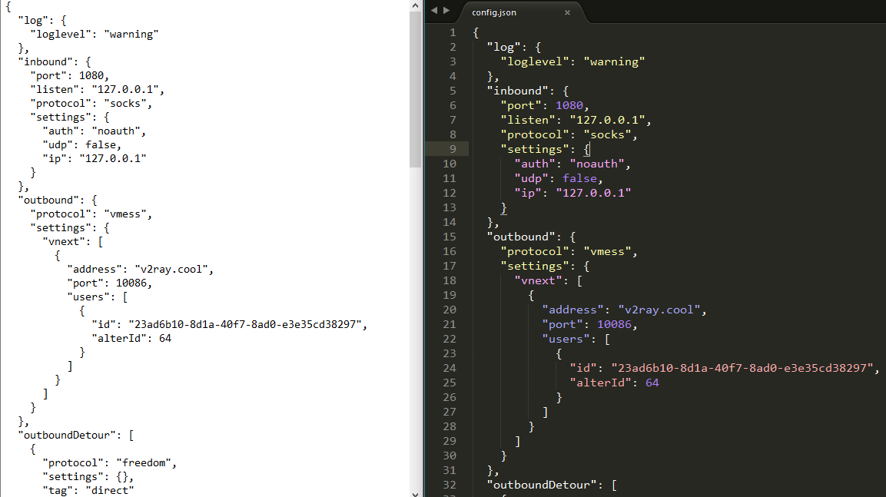
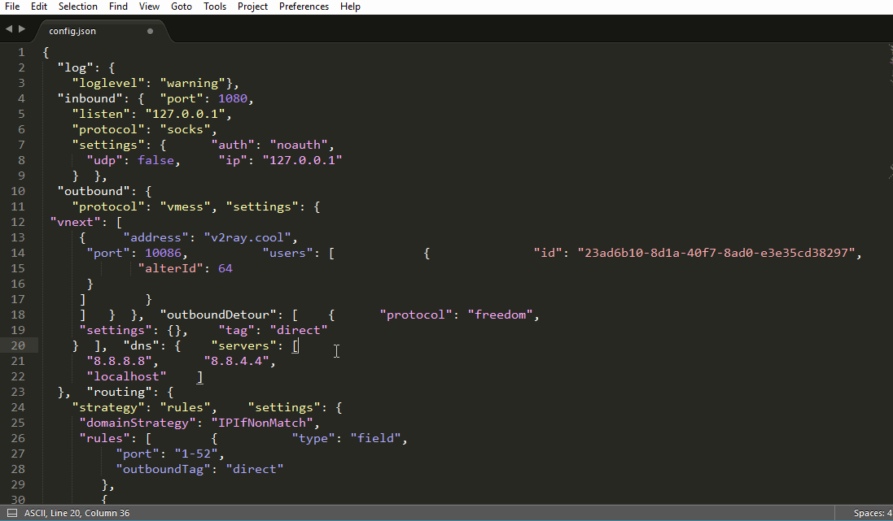
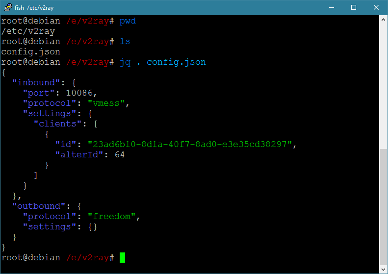
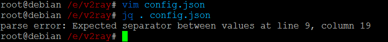
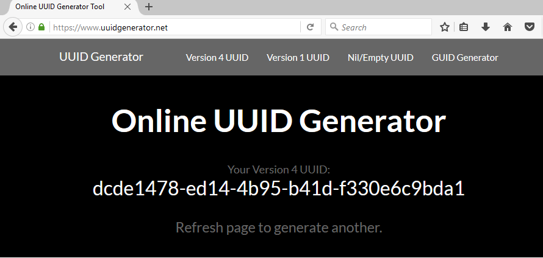

# VMess

VMess 協議是由 V2Ray 原創並使用於 V2Ray 的加密傳輸協議，如同 Shadowsocks 一樣爲了對抗牆的[深度包檢測](https://zh.wikipedia.org/wiki/%E6%B7%B1%E5%BA%A6%E5%8C%85%E6%A3%80%E6%B5%8B)而研發的。在 V2Ray 上客戶端與服務器的通信主要是通過 VMess 協議通信。

本小節給出了 VMess 的配置文件，其實也就是服務器和客戶端的基本配置文件，這是 V2Ray 能夠運行的最簡單的配置。

V2Ray 使用 inbound(傳入) 和 outbound(傳出) 的結構，這樣的結構非常清晰地體現了數據包的流動方向，同時也使得 V2Ray 功能強大複雜的同時而不混亂，清晰明瞭。形象地說，我們可以把 V2Ray 當作一個盒子，這個盒子有入口和出口(即 inbound 和 outbound)，我們將數據包通過某個入口放進這個盒子裏，然後這個盒子以某種機制（這個機制其實就是路由，後面會講到）決定這個數據包從哪個出口吐出來。以這樣的角度理解的話，V2Ray 做客戶端，則 inbound 接收來自瀏覽器數據，由 outbound 發出去(通常是發到 V2Ray 服務器)；V2Ray 做服務器，則 inbound 接收來自 V2Ray 客戶端的數據，由 outbound 發出去(通常是如 Google 等想要訪問的目標網站)。

-------

## 配置前的準備

實際上，根本不用準備什麼，只要有一個文本編輯器(text editor)就可以修改配置了。但我還是打算囉嗦一些，因爲我發現新手容易犯語法（格式）不正確的錯誤，這個很正常新手上路對路況總會不是很熟悉；另外一個就是不會使用工具，用了很多年電腦文本編輯還是 Windows 自帶的記事本（在我身邊有不少敲代碼的，平常看某個代碼文件很少打開 IDE 或者使用好點的文本編輯器，而是直接用記事本看），用水果刀切菜可以嗎？當然可以，建議你親自體驗一下。如果你會用工具，會非常高效的而且裝有一些插件可以語法檢查，將代碼格式化。

文本編輯器有許多，比如說 Sublime Text、VS code、atom、notepad++，上面這些都是跨平臺的，具體如何使用請自行 Google 吧。這些軟件都可以做到高亮顯示、摺疊、格式化等，建議使用，如果你不想安裝軟件，網上也有一些在線的 json 編輯器，還自動檢查語法。如果你非要用 Windows 的記事本我也無話可說。

下面是一張 Windows 自帶的記事本對比 Sublime Text 查看同一個 json 文件的圖片，孰優孰劣大家心中自有判斷。


又比如格式化功能：


對於 Linux 有一個軟件叫 jq，可以執行這樣的指令檢查配置文件的語法是否正確：
```
$ jq . config.json
```
這裏的 config.json 是當前目錄下的 config.json。特別注意命令中的點 . 不能省去。


當我把 "23ad6b10-8d1a-40f7-8ad0-e3e35cd38297" 後的逗號 , 刪去時：



（從 v2.11 起新增了一個註釋功能，配置文件允許 `//` 和 `/**/` 註釋。但是 JSON 的標準格式的沒有註釋的，也就是說如果你給配置文件加了註釋，再使用上文我說的格式化功能會報錯說你的 JSON 語法（格式）不對。）

不過，最好還是使用 V2Ray 提供的配置檢查功能（test 選項），因爲可以檢查 JSON 語法錯誤外的問題，比如說突然間手抖把 vmess 寫成了 vmss，一下子就檢查出來了。
```
$ /usr/bin/v2ray/v2ray -test -config /etc/v2ray/config.json
failed to parse json config: Ext|Tools|Conf|Serial: failed to parse json config > Ext|Tools|Conf: failed to load inbound detour config. > Ext|Tools|Conf: unknown config id: vmss
Main: failed to read config file: /etc/v2ray/config.json > Main|Json: failed to execute v2ctl to convert config file. > exit status 255
```

如果是配置文件沒問題，則是這樣的：

```
$ /usr/bin/v2ray/v2ray -test -config /etc/v2ray/config.json
V2Ray v3.15 (die Commanderin) 20180329
An unified platform for anti-censorship.
Configuration OK.
```

## 配置

以下給出了 VMess 的配置文件，包含客戶端和服務器端，將你的配置替換成下面給出的配置，然後將服務器地址修改成你的就可以正常使用。修改完配置之後要重啓 V2Ray 才能使用新配置生效。

::: danger 注意
VMess 協議的認證基於時間，一定要保證服務器和客戶端的系統時間相差要在90秒以內。
:::

### 客戶端配置

以下是客戶端配置，將客戶端的 config.json 文件修改成下面的內容，修改完成後要重啓 V2Ray 纔會使修改的配置生效。
```json
{
  "inbounds": [
    {
      "port": 1080, // 監聽端口
      "protocol": "socks", // 入口協議爲 SOCKS 5
      "sniffing": {
        "enabled": true,
        "destOverride": ["http", "tls"]
      },
      "settings": {
        "auth": "noauth"  //socks的認證設置，noauth 代表不認證，由於 socks 通常在客戶端使用，所以這裏不認證
      }
    }
  ],
  "outbounds": [
    {
      "protocol": "vmess", // 出口協議
      "settings": {
        "vnext": [
          {
            "address": "serveraddr.com", // 服務器地址，請修改爲你自己的服務器 IP 或域名
            "port": 16823,  // 服務器端口
            "users": [
              {
                "id": "b831381d-6324-4d53-ad4f-8cda48b30811",  // 用戶 ID，必須與服務器端配置相同
                "alterId": 64 // 此處的值也應當與服務器相同
              }
            ]
          }
        ]
      }
    }
  ]
}
```

在配置當中，有一個 id (在這裏的例子是 b831381d-6324-4d53-ad4f-8cda48b30811)，作用類似於 Shadowsocks 的密碼(password), VMess 的 id 的格式必須與 UUID 格式相同。關於 id 或者 UUID 沒必要了解很多，在這裏只要清楚以下幾點就足夠了：
* 相對應的 VMess 傳入傳出的 id 必須相同（如果你不是很明白這句話，那麼可以簡單理解成服務器與客戶端的 id 必須相同）
* 由於 id 使用的是 UUID 的格式，我們可以使用任何 UUID 生成工具生成 UUID 作爲這裏的 id。比如 [UUID Generator](https://www.uuidgenerator.net/) 這個網站，只要一打開或者刷新這個網頁就可以得到一個 UUID，如下圖。或者可以在 Linux 使用命令 `cat /proc/sys/kernel/random/uuid` 生成。



### 服務器配置

以下是服務器配置，將服務器 /etc/v2ray 目錄下的 config.json 文件修改成下面的內容，修改完成後要重啓 V2Ray 纔會使修改的配置生效。
```json
{
  "inbounds": [
    {
      "port": 16823, // 服務器監聽端口
      "protocol": "vmess",    // 主傳入協議
      "settings": {
        "clients": [
          {
            "id": "b831381d-6324-4d53-ad4f-8cda48b30811",  // 用戶 ID，客戶端與服務器必須相同
            "alterId": 64
          }
        ]
      }
    }
  ],
  "outbounds": [
    {
      "protocol": "freedom",  // 主傳出協議
      "settings": {}
    }
  ]
}
```

## 原理簡析

根據上文給出的配置，在這裏簡單的介紹一下 V2Ray 的工作原理。

無論是客戶端還是服務器，配置文件都由兩部分內容組成： `inbounds` 和 `outbounds`。V2Ray 沒有使用常規代理軟件的 C/S（即客戶端/服務器）結構，它既可以當做服務器也可以作爲客戶端。於是我們可以從另一個角度來理解，認爲每一個 V2Ray 都是一個節點，`inbound` 是關於如何與上一個節點連接的配置，`outbound` 是關於如何與下一個節點連接的配置。對於第一個節點，`inbound` 與瀏覽器連接；對於最後一個節點，`outbound`與目標網站連接。`inbounds` 和 `outbounds` 是 `inbound` 和 `outbound` 的集合，意味着每一個 V2Ray 節點都可以有多個入口和出口。本例當中的入口和出口都只有一個，這是爲了便於說明和理解。

### 客戶端

客戶端配置中的 inbounds，port 爲 1080，即 V2Ray 監聽了一個端口 1080，協議是 socks。之前我們已經把瀏覽器的代理設置好了（SOCKS Host: 127.0.0.1，Port: 1080），假如訪問了 google.com，瀏覽器就會發出一個數據包打包成 socks 協議發送到本機（127.0.0.1指的本機，localhost）的 1080 端口，這個時候數據包就會被 V2Ray 接收到。

再看 outbounds，protocol 是 vmess，說明 V2Ray 接收到數據包之後要將數據包打包成 [VMess](https://www.v2ray.com/developer/protocols/vmess.html) 協議並且使用預設的 id 加密（這個例子 id 是 b831381d-6324-4d53-ad4f-8cda48b30811），然後發往服務器地址爲 serveraddr.com 的 16823 端口。服務器地址 address 可以是域名也可以是 IP，只要正確就可以了。


在客戶端配置的 inbounds 中，有一個 `"sniffing"` 字段，V2Ray 手冊解釋爲“流量探測，根據指定的流量類型，重置所請求的目標”，這話不太好理解，簡單說這東西就是從網絡流量中識別出域名。這個 sniffing 有兩個用處：

1. 解決 DNS 污染；
2. 對於 IP 流量可以應用後文提到的域名路由規則；
3. 識別 BT 協議，根據自己的需要攔截或者直連 BT 流量(後文有一節專門提及)。

如果這段話不懂，沒關係，照着寫吧。

### 服務器

接着看服務器，服務器配置的 id 是 b831381d-6324-4d53-ad4f-8cda48b30811，所以 V2Ray 服務器接收到客戶端發來的數據包時就會嘗試用 b831381d-6324-4d53-ad4f-8cda48b30811 解密，如果解密成功再看一下時間對不對，對的話就把數據包發到 outbound 去，outbound.protocol 是 freedom（freedom 的中文意思是自由，在這裏姑且將它理解成直連吧），數據包就直接發到 google.com 了。

實際上數據包的流向就是：
```
{瀏覽器} <--(socks)--> {V2Ray 客戶端 inbound <-> V2Ray 客戶端 outbound} <--(VMess)-->  {V2Ray 服務器 inbound <-> V2Ray 服務器 outbound} <--(Freedom)--> {目標網站}
```

配置中還有一個 alterId 參數，這個參數主要是爲了加強防探測能力。理論上 alterId 越大越好，但越大就約佔內存(只針對服務器，客戶端不佔內存)，所以折中之下設一箇中間值纔是最好的。那麼設多大才是最好的？其實這個是分場景的，我沒有嚴格測試過這個，不過根據經驗，alterId 的值設爲 30 到 100 之間應該是比較合適的。alterId 的大小要保證客戶端的小於等於服務器的。

有人疑惑請求發出去後數據怎麼回來，畢竟大多數的場景是下載。這個其實不算是問題，既然請求通過 V2Ray 發出去了，響應數據也會通過 V2Ray 原路返回（也許會有朋友看到這話會馬上反駁說不一定是原路返回的，有這種想法的估計是非常瞭解 TCP/IP 協議的，何必較這個勁，這是底層的東西，又掌控在運營商手裏，從應用層理解原路返回又有何不可）。

--------

## 注意事項

- 爲了讓淺顯地介紹 V2Ray 的工作方式，本節中關於原理簡析的描述有一些地方是錯誤的。但我知識水平又不夠，還不知道該怎麼改，暫且將錯就錯。正確的工作原理在用戶手冊的 [VMess 協議](https://www.v2ray.com/developer/protocols/vmess.html) 有詳細的說明。
- id 爲 UUID 格式，請使用軟件生成，不要嘗試自己造一個，否則很大程度上造出一個錯誤的格式來。
- VMess 協議可以設定加密方式，但 VMess 不同的加密方式對於過牆沒有明顯差別，本節沒有給出相關配置方式（因爲這不重要，默認情況下 VMess 會自己選擇一種比較合適的加密方式），具體配置可見 [V2Ray 手冊](https://v2ray.com/chapter_02/protocols/vmess.html)，不同加密方式的性能可參考[性能測試](/app/benchmark.md)。

-------

## 排錯指引

按照前文的指導操作，通常都能成功部署 V2Ray。然而總會有部分讀者可能是看漏某些地方，導致雖然安裝好了卻無法連接。如果出現了這樣的問題，可以嘗試按下面的步驟一一進行排錯。

#### 打開客戶端閃退

可能原因：客戶端的配置文件上不正確。

修正方法：請仔細檢查配置文件並修改正確。

#### 客戶端提示 `Socks: unknown Socks version`

可能原因：客戶端配置的 inboud 設置成了 socks 而瀏覽器的代理協議設置爲 http。

修正方法：修改配置文件使客戶端的 inboud 的 protocol 和瀏覽器代理設置的協議保持一致。

#### 客戶端提示 `Proxy|HTTP: failed to read http request > malformed HTTP request "\x05\x01\x00"`

可能原因：客戶端配置的 inboud 設置成了 https 而瀏覽器的代理協議設置爲 socks4 或者 socks5。

修正方法：修改配置文件使客戶端的 inboud 的 protocol 和瀏覽器代理設置的協議保持一致。

#### 服務器執行 `systemctl status v2ray` 輸出提示 `Main: failed to read config file...`

可能原因：服務器的配置文件不正確。

修正方法：請仔細檢查配置文件並修改正確。

#### 執行 `cat /var/log/v2ray/error.log` 或者 `systemctl status v2ray` 出現 rejected  Proxy|VMess|Encoding: invalid user

可能原因：服務器與客戶端的系統時間或者 id 不一致或者 alterId 不一致。

修正方法：請校準系統時間或將 id 以及 alterId 修改一致。


#### 以上幾點都排除之後，請仔細檢查：

1). 瀏覽器的代理設置中的端口號與客戶端的 inbound 的 port 是否一致；

2). 客戶端中的 outbound 設置的 address 與 vps 的ip是否一致；

3). 客戶端中的 outbound 設置的address 與服務器的 inbound 的 port 是否一致；

4). VPS 是否開啓了防火牆將連接攔截了；

5). 客戶端是否安裝在如學校、公司之類的場所，如果是，確認這些單位是否有防火牆攔截了連接；

對於 1) 到 3)，可以通過檢查配置確定是否有問題。對於 4) 和 5)，你需要與 VPS 提供商和單位網管聯繫溝通。

#### 如果你仔細檢查了以上幾點並將問題排除了，結果還是無法通過 V2Ray 上網，那麼你可以考慮：

 1). 仔細看前方的教程，逐步按照教程來不要錯在漏，重新部署 V2Ray。部署過程中時刻注意[部署之前](/prep/start.md)提到的注意點；

 2). 直接放棄；

 3). 向大牛請教。

-----

#### 更新歷史

- 2017-08-08 排錯指引補充
- 2017-08-06 添加排錯指引
- 2018-02-09 補充說明
- 2018-04-05 內容補充
- 2018-09-03 更進一些 V2Ray 的變化，並修改一些描述
- 2018-11-09 跟進新 v4.0+ 的配置格式
- 2018-02-01 domainOverride 改爲 sniffing
- 2019-10-27 sniffing 不再影響 tor 的使用
